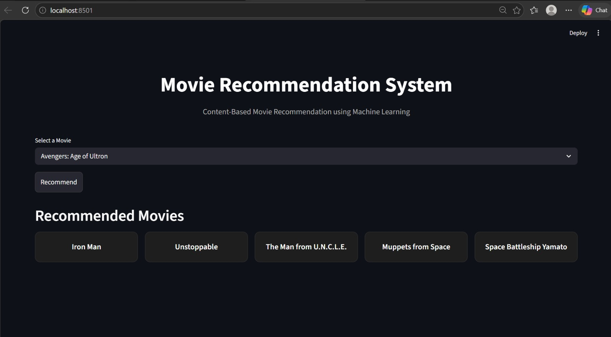

# Movie Recommendation System

A Content-Based Movie Recommendation System developed using Python, Machine Learning, and Streamlit. The application recommends movies similar to a selected movie by analyzing movie metadata such as genres, keywords, cast, crew, and overview.

## Project Overview

This project implements a Content-Based Filtering approach for movie recommendations. Instead of relying on user ratings, the system identifies similarities between movies based on their features and recommends the most relevant movies.

The recommendation engine uses text vectorization and cosine similarity to find similar movies efficiently.

## Application Preview



The application allows users to:

* Select a movie from a dropdown list.
* Generate recommendations instantly.
* View the top 5 similar movies.
* Experience a simple and user-friendly interface.

## Features

* Content-Based Movie Recommendation
* Interactive Streamlit Web Application
* Top 5 Similar Movie Recommendations
* Fast Recommendation Generation
* Machine Learning-Based Similarity Matching
* Clean and Responsive User Interface
* Easy Movie Selection Through Dropdown Menu

## Technologies Used

### Programming Language

* Python

### Libraries

* Pandas
* NumPy
* Scikit-Learn
* Pickle
* Streamlit

### Machine Learning Concepts

* Content-Based Filtering
* Feature Engineering
* Text Vectorization
* Cosine Similarity

## Dataset

The project uses the following datasets from TMDB (The Movie Database):

* tmdb_5000_movies.csv
* tmdb_5000_credits.csv

The datasets contain:

* Movie Titles
* Genres
* Keywords
* Cast Information
* Crew Information
* Movie Overview
* Additional Metadata

## Project Workflow

### 1. Data Collection

Movie and credits datasets are loaded into Pandas DataFrames.

### 2. Data Preprocessing

Relevant columns are selected and cleaned:

* Genres
* Keywords
* Cast
* Crew
* Overview

Missing values are handled and unnecessary columns are removed.

### 3. Feature Engineering

Important movie features are combined into a single text column called `tags`.

### 4. Text Vectorization

The tags column is transformed into numerical vectors using CountVectorizer.

### 5. Similarity Calculation

Cosine Similarity is used to measure similarity between movies and create a similarity matrix.

### 6. Model Storage

Processed data is stored using Pickle files:

* movies.pkl
* similarity.pkl

### 7. Recommendation Generation

When a user selects a movie:

1. The selected movie is identified.
2. Similarity scores are retrieved.
3. Movies are ranked according to similarity.
4. Top 5 recommended movies are displayed.

## Project Structure

```text
Movie-Recommendation-System/
│
├── app.py
├── MovieRecommendation.ipynb
├── movies.pkl
├── similarity.pkl
├── tmdb_5000_movies.csv
├── tmdb_5000_credits.csv
├── screenshots/
│   └── movie-recommendation-system.png
├── requirements.txt
├── README.md
└── .gitignore
```

## How to Run the Project

### Clone the Repository

```bash
git clone https://github.com/Kanishad2025/Movie_recommendation.git

### Navigate to the Project Folder

```bash
cd Movie-Recommendation-System
```

### Install Required Libraries

```bash
pip install -r requirements.txt
```

### Run the Application

```bash
python -m streamlit run app.py
```

### Open in Browser

```text
http://localhost:8501
```

## Recommendation Algorithm

The recommendation process follows these steps:

1. User selects a movie.
2. Movie index is identified.
3. Similarity scores are fetched from the similarity matrix.
4. Movies are sorted based on similarity scores.
5. Top 5 similar movies are recommended.

## Future Enhancements

* Movie Poster Integration
* TMDB API Integration
* Search Functionality
* Hybrid Recommendation System
* User Authentication
* Movie Ratings and Reviews
* Cloud Deployment

## Learning Outcomes

This project helped in understanding:

* Data Cleaning and Preprocessing
* Feature Engineering
* Natural Language Processing Basics
* Text Vectorization
* Cosine Similarity
* Machine Learning Concepts
* Streamlit Application Development
* Git and GitHub Workflow

## Author

Kanisha

B.Tech Student

## Acknowledgement

Dataset Source: TMDB (The Movie Database)

This project was developed for educational purposes to understand recommendation systems, machine learning techniques, and web application development using Streamlit.
